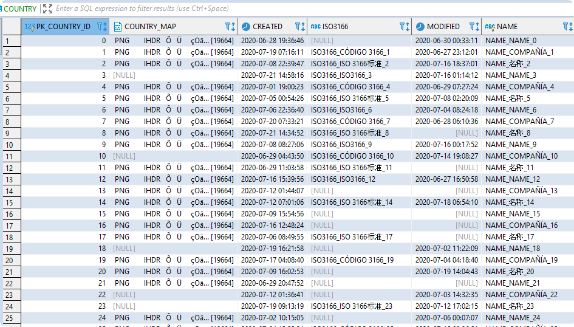
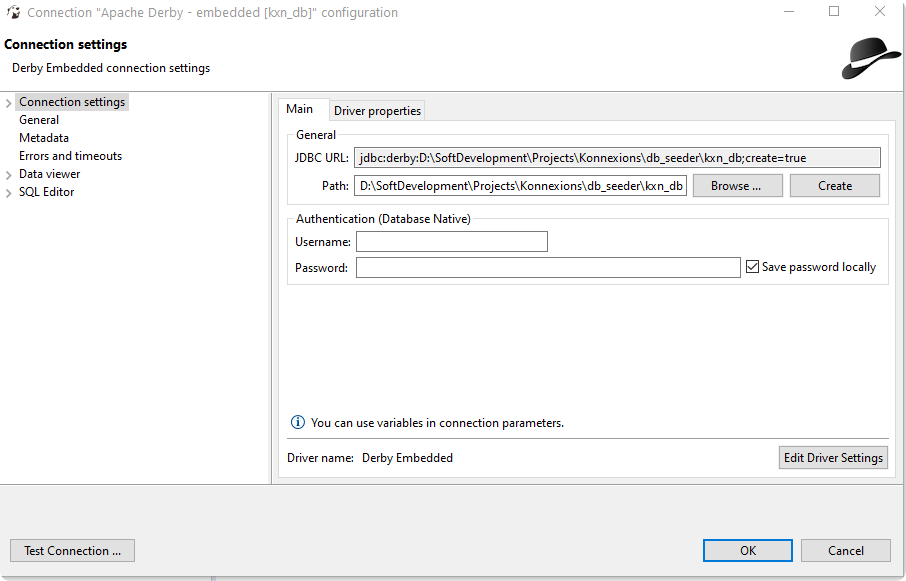
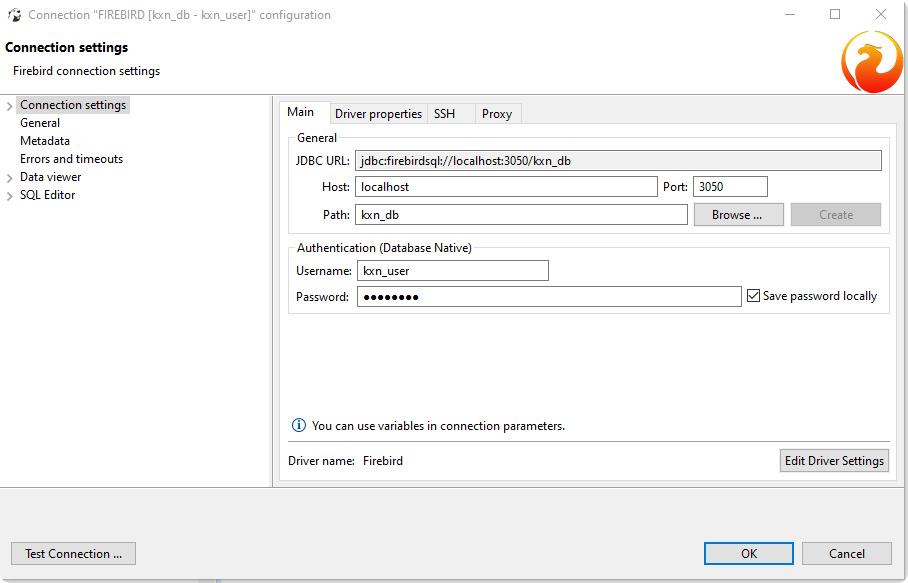
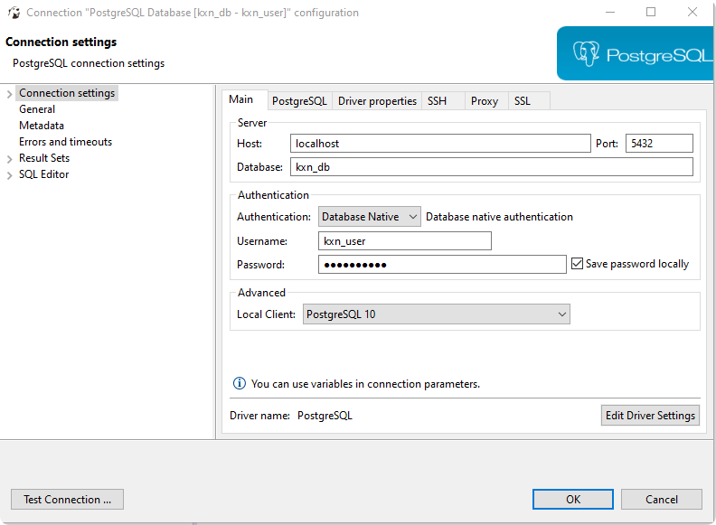
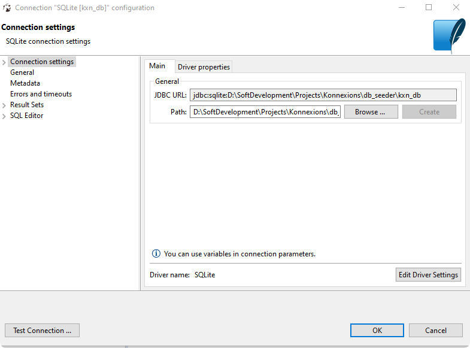

# db_seeder - Creation of Dummy Data in a Variety of Database Management Systems.


----

### Table of Contents

**[1. Introduction](#introduction)**<br>
**[2. Data](#data)**<br>
**[2.1 Logical Schema](#data_logical)**<br>
**[2.2 Construction of the Dummy Data Content](#data_construction)**<br>
**[3. Installation](#installation)**<br>
**[4. Operating Instructions](#operating_instructions)**<br>
**[4.1 Scripts](#operating_instructions_scripts)**<br>
**[4.2 Control Parameters](#operating_instructions_control)**<br>
**[5. DBMS Specific Technical Details](#dbms_specifica)**<br>
**[6. Contributing](#contributing)**<br>

----

## <a name="introduction"></a> 1. Introduction

`db_seeder` allows the generation of dummy data in different database management systems. 
Currently the following management database systems are supported:
- [Apache Derby](https://db.apache.org/derby/)
  - relational database management system (RDBMS)
  - open source
  - client and embedded (not supported here) version
  - **[see technical details here](#details_derby)**
- [CrateDB](https://crate.io/)
  - relational database management system (RDBMS)
  - open source
  - client only version
  - **[see technical details here](#details_cratedb)**
- [CUBRID](https://www.cubrid.org) 
  - relational database management system (RDBMS)
  - open source
  - client only version
  - **[see technical details here](#details_cubrid)**
- [Firebird](https://firebirdsql.org) 
  - relational database management system (RDBMS)
  - open source
  - client and embedded (not supported here) version
  - **[see technical details here](#details_firebird)**
- [IBM Db2 Database](https://www.ibm.com/products/db2-database) 
  - relational database management system (RDBMS)
  - client only version
  - **[see technical details here](#details_ibmdb2)**
- [MariaDB Server](https://mariadb.com/) 
  - relational database management system (RDBMS)
  - open source
  - client only version
  - **[see technical details here](#details_mariadb)**
- [Microsoft SQL Server](https://www.microsoft.com/en-us/sql-server/sql-server-2019) 
  - relational database management system (RDBMS)
  - client only version
  - **[see technical details here](#details_mssqlserver)**
- [MySQL Database](https://www.mysql.com/) 
  - relational database management system (RDBMS)
  - open source
  - client only version
  - **[see technical details here](#details_mysql)**
- [Oracle Database](https://www.oracle.com/database/)
  - relational database management system (RDBMS)
  - client only version
  - **[see technical details here](#details_oracle)**
- [PostgreSQL Database](https://www.postgresql.org/)
  - relational database management system (RDBMS)
  - open source
  - client only version
  - **[see technical details here](#details_postgresql)**
- [SQLite](https://www.sqlite.org/)
  - relational database management system (RDBMS)
  - open source
  - embedded only version
  - **[see technical details here](#details_sqlite)**

The names of the database, the schema and the user can be freely chosen, unless the respective database management system contains restrictions. 
If the selected database, schema or user already exists, it is deleted with all including data. 
`db_seeder` then creates the selected database, schema or user and generates the desired dummy data.
A maximum of 2 147 483 647 rows can be generated per database table.

[//]: # (===========================================================================================)

### 1.1 Relational Database Management Systems

| DBMS | DB Ticker Symbol(s) | Tested Versions |
|---|---|---|
| Apache Derby | DERBY, DERBY_EMB | 10.15.2.0 | 
| CrateDB | CRATEDB | 4.1.6 | 
| CUBRID | CUBRID | 10.2 | 
| Firebird | FIREBIRD | 3.0.5 | 
| IBM Db2 Database | IBMDB2 | 11.5.1.0 | 
| MariaDB Server | MARIADB | 10.4.13 - 10.5.4 | 
| Microsoft SQL Server | MSSQLSERVER | 2019| 
| MySQL Database | MYSQL | 8.0.20 | 
| Oracle Database | ORACLE | 12c, 18c, 19c |
| PostgreSQL Database | POSTGRESQL | 12.3 |
| SQLite | SQLITE | 3.32.2 |

[//]: # (===========================================================================================)

## <a name="data"></a> 2. Data 

The underlying data model is quite simple and is shown here in the relational version.
The 5 database tables CITY, COMPANY, COUNTRY, COUNTRY_STATE, and TIMEZONE form a simple hierarchical structure and are therefore connected in the relational model via corresponding foreign keys.  

### <a name="data_logical"></a> 2.1 Logical Schema

The abbreviations in the following illustration (created with Toad Data Modeler) mean:

- (AK1) - alternate key (unique key)
- FK    - foreign key
- NN    - not null
- PK    - primary key


[//]: # (===========================================================================================)

### <a name="data_construction"></a> 2.2 Construction of the Dummy Data Content

25% of columns that can contain the value `NULL` are randomly assigned the value `NULL`.

#### 2.2.1 Binary Large Objects

Examples: BLOB, BYTEA, LONGBLOB, VARBINARY (MAX)

- The content of the file `blob.png` from the resource directory (`src/main/resources`) is loaded into these columns.
This file contains the company logo of Konnexions GmBH.

#### 2.2.2 Character Large Objects

Examples: CLOB, LONGTEXT, TEXT, VARCHAR (MAX)

- The content of the file `clob.md` from the resource directory (`src/main/resources`) is loaded into these columns.
This file contains the text of the Konnexions Public License (KX-PL).

#### 2.2.3 Decimal Numbers

Examples: NUMBER

- All decimal number columns are filled with random numbers.

#### 2.2.4 Integers

Examples: BIGINT, INTEGER, NUMBER

- If possible, primary key columns are filled by the autoincrement functionality of the respective DBMS - otherwise `autoincrement` is simulated..
- All other integer columns are filled with random numbers.

#### 2.2.5 String Data

Examples: TEXT, VARCHAR, VARCHAR2

- 25% of the `Y` / `N` flag column (`COMPANY.ACTIVE`) is randomly assigned the value `N`.
- Provided the length of the column is sufficient, the content of the column is constructed as follows:
  - column name in capital letters
  - underscore `_`
  - content of the primary key left-justified
- Special cases:
  - `COMPANY.POSTAL_CODE` - constant `POSTAL_CODE_` and the right 8 digits of the primary key with leading zeros
  - `COUNTRY.ISO3166` - the right 2 digits of the primary key with leading zeros
  - `COUNTRY_STATE.SYMBOL` - constant `SYMBOL_` and the right 3 digits of the primary key with leading zeros
  - `TIMEZONE.ABBREVIATION` - constant `ABBREVIATION_` and the right 7 digits of the primary key with leading zeros

#### 2.2.6 Temporal Data

Examples: DATETIME, DATETIME2, INTEGER, REAL, TEXT, TIMESTAMP

- A randomly generated timestamp is assigned to all columns that can contain temporal data.

#### 2.2.7 Examples

##### 1. Table CITY


##### 2. Table COUNTRY



[//]: # (===========================================================================================)

##### 3. Table TIMEZONE


## <a name="installation"></a> 3. Installation

The easiest way is to download a current release of `db_seeder`.
You can find the necessary link [here](https://github.com/KonnexionsGmbH/db_seeder).
The system requirements are described in the respective release notes. 

## <a name="operating_instructions"></a> 4. Operating Instructions 

### <a name="operating_instructions_scripts"></a> 4.1 Scripts

Using the Konnexions development docker image from DockerHub (see [here](https://hub.docker.com/repository/docker/konnexionsgmbh/kxn_dev)) saves the effort of installing the latest Java version. 
To run `db_seeder`, only the libraries in the `lib` directory and the appropriate batch script of `run_db_seeder` are required. 
All parameters used in `db_seeder` can be adjusted in the batch script to suit your needs.

#### 4.1.1 Batch Script `run_db_seeder`

The `run_db_seeder` batch script generates dummy data for a selected DBMS.
Prerequisite is a connection to a suitable Database, e.g. via a Docker container.
The following script parameter is required: 

- `DB_SEEDER_DBMS_DEFAULT`: the ticker symbol of the desired database management system


#### 4.1.2 Batch Script `run_db_seeder_setup_dbms`

The `run_db_seeder_setup_dbms` batch script creates an empty database for a selected DBMS.
With all client DBMS this database is based on a corresponding Docker image.
Therefore, the prerequisite is that Docker is started and a suitable connection to the Internet exists.
The following script parameters are required: 

- `DB_SEEDER_DBMS_DEFAULT`: the ticker symbol of the desired database management system
- `DB_SEEDER_DELETE_EXISTING_CONTAINER`: delete the existing Docker container (`yes`/`no`)
 
[//]: # (===========================================================================================)

### <a name="operating_instructions_control"></a> 4.2 Control Parameters
 
#### 4.2.1 Supported Parameters

The flow control parameters for `db_seeder` are stored in the properties file `src/main/resources/db_seeder.properties` and can all be overridden by the environment variables defined in the batch script.
The following control parameters are currently supported:

```
db_seeder.cratedb.connection.port=5432
db_seeder.cratedb.connection.prefix=crate://
db_seeder.cratedb.password=cratedb
db_seeder.cratedb.user=kxn_user

db_seeder.cubrid.connection.port=33000
db_seeder.cubrid.connection.prefix=jdbc:CUBRID:
db_seeder.cubrid.database=kxn_db
db_seeder.cubrid.password=cubrid
db_seeder.cubrid.user=kxn_user

db_seeder.derby.connection.port=1527
db_seeder.derby.connection.prefix=jdbc:derby:
db_seeder.derby.database=kxn_db

db_seeder.encoding.iso_8859_1=true
db_seeder.encoding.utf_8=true

db_seeder.firebird.connection.port=3050
db_seeder.firebird.connection.prefix=jdbc:firebirdsql://
db_seeder.firebird.database=kxn_db
db_seeder.firebird.password.sys=firebird
db_seeder.firebird.password=firebird
db_seeder.firebird.user=kxn_user

db_seeder.ibmdb2.connection.port=50000
db_seeder.ibmdb2.connection.prefix=jdbc:db2://
db_seeder.ibmdb2.database=kxn_db
db_seeder.ibmdb2.password=ibmdb2
db_seeder.ibmdb2.schema=kxn_schema

db_seeder.jdbc.connection.host=localhost

db_seeder.mariadb.connection.port=3306
db_seeder.mariadb.connection.prefix=jdbc:mariadb://
db_seeder.mariadb.database=kxn_db
db_seeder.mariadb.password.sys=mariadb
db_seeder.mariadb.password=mariadb
db_seeder.mariadb.user=kxn_user

db_seeder.max.row.city=1800
db_seeder.max.row.company=5400
db_seeder.max.row.country=200
db_seeder.max.row.country_state=600
db_seeder.max.row.timezone=11

db_seeder.mssqlserver.connection.port=1433
db_seeder.mssqlserver.connection.prefix=jdbc:sqlserver://
db_seeder.mssqlserver.database=kxn_db
db_seeder.mssqlserver.password.sys=mssqlserver_2019
db_seeder.mssqlserver.password=mssqlserver_2019
db_seeder.mssqlserver.schema=kxn_schema
db_seeder.mssqlserver.user=kxn_user

db_seeder.mysql.connection.port=3306
db_seeder.mysql.connection.prefix=jdbc:mysql://
db_seeder.mysql.connection.suffix=?serverTimezone=UTC
db_seeder.mysql.database=kxn_db
db_seeder.mysql.password.sys=mysql
db_seeder.mysql.password=mysql
db_seeder.mysql.user=kxn_user

db_seeder.oracle.connection.port=1521
db_seeder.oracle.connection.prefix=jdbc:oracle:thin:@//
db_seeder.oracle.connection.service=orclpdb1
db_seeder.oracle.password.sys=oracle
db_seeder.oracle.password=oracle
db_seeder.oracle.user=kxn_user

db_seeder.postgresql.connection.port=5432
db_seeder.postgresql.connection.prefix=jdbc:postgresql://
db_seeder.postgresql.database=kxn_db
db_seeder.postgresql.password.sys=postgresql
db_seeder.postgresql.password=postgresql
db_seeder.postgresql.user=kxn_user

db_seeder.sqlite.connection.prefix=jdbc:sqlite:
db_seeder.sqlite.database=kxn_db
```

#### 4.2.2 Explanation and Cross-reference

| Property incl. Default Value [db.seeder.] | Environment Variable [DB_SEEDER_] | Used By | Description |
| --- | --- | --- | --- |
| <db_ticker>.connection.port=<port_number> | <DB_TICKER>_CONNECTION_PORT | DERBY, CRATEDB, CUBRID, FIREBIRD, IBMDB2, MARIADB, MSSQLSERVER, MYSQL, ORACLE, POSTGRESQL | port number of the database server |
| <db_ticker>.connection.prefix=<url_prefix> | <DB_TICKER>_CONNECTION_PREFIX | DERBY, CRATEDB, CUBRID, FIREBIRD, IBMDB2, MARIADB, MSSQLSERVER, MYSQL, ORACLE, POSTGRESQL, SQLITE | prefix of the database connection string |
| <db_ticker>.connection.suffix=<url_suffix> | <DB_TICKER>_CONNECTION_SUFFIX | MYSQL | suffix of the database connection string |
| <db_ticker>.database=kxn_db | <DB_TICKER>_DATABASE | DERBY, CUBRID, FIREBIRD, IBMDB2, MARIADB, MSSQLSERVER, MYSQL, POSTGRESQL, SQLITE | database name |
| <db_ticker>.password.sys=<db_ticker> | <DB_TICKER>_PASSWORD_SYS | FIREBIRD, MARIADB, MSSQLSERVER, MYSQL, ORACLE, POSTGRESQL | password of the privileged user |
| <db_ticker>.password=<db_ticker> | <DB_TICKER>_PASSWORD | CRATEDB, CUBRID, FIREBIRD, IBMDB2, MARIADB, MSSQLSERVER, MYSQL, ORACLE, POSTGRESQL | password of the normal user |
| <db_ticker>.schema=kxn_schema | <DB_TICKER>_SCHEMA | IBMDB2, MSSQLSERVER | schema name |
| <db_ticker>.user=kxn_user | <DB_TICKER>_USER | CRATEDB, CUBRID, FIREBIRD, MARIADB, MSSQLSERVER, MYSQL, ORACLE, POSTGRESQL | name of the normal user |
| encoding.iso_8859_1=false/true | ENCODING_ISO_8859_1 | FIREBIRD | generate column content with Western Latin characters included |
| encoding.utf_8=false/true | ENCODING_UTF_8 | FIREBIRD | generate column content with tradtional chinese characters included |
| jdbc.connection.host=localhost | JDBC_CONNECTION_HOST | CRATEDB, CUBRID, FIREBIRD, IBMDB2, MARIADB, MSSQLSERVER, MYSQL, ORACLE, POSTGRESQL | name or ip address of the database server |
| max.row.t...t=9...9 | MAX_ROW_T...T | Relational DB | number of rows to be generated (per database table t...t) |
|     |     |     |     |

## <a name="dbms_specifica"></a> 5. DBMS Specific Technical Details

[DBeaver](https://dbeaver.io/) is a great tool to analyze the database content. 
Below are also DBeaver based connection parameter examples for each database management system. 

**[Apache Derby](#details_derby)** / 
**[CrateDB](#details_cratedb)** / 
**[CUBRID](#details_cubrid)** / 
**[Firebird](#details_firebird)** /  
**[IBM Db2 Database](#details_ibmdb2)** / 
**[MariaDB Server](#details_mariadb)** / 
**[Microsoft SQL Server](#details_mssqlserver)** / 
**[MySQL Database](#details_mysql)** / 
**[Oracle Database](#details_oracle)** / 
**[PostgreSQL Database](#details_postgresql)** / 
**[SQLite](#details_sqlite)**

[//]: # (===========================================================================================)

### <a name="details_derby"></a> 5.1 Apache Derby

- data types:

| JDBC Data Type | Apache Derby Type |
| --- | --- |
| Blob / byte[] | BLOB |
| Clob | CLOB |
| long | BIGINT |
| string | VARCHAR |
| timestamp | TIMESTAMP |

- DDL syntax:
  - CREATE DATABASE - n/a 
  - [CREATE SCHEMA](https://db.apache.org/derby/docs/10.15/ref/index.html)
  - [CREATE TABLE](https://db.apache.org/derby/docs/10.15/ref/index.html) 
  - CREATE USER - n/a 

- Docker image (latest - only client version``):
  - pull command: `docker pull konnexionsgmbh/apache_derby:10.15.2.0`
  - [DockerHub](https://hub.docker.com/repository/docker/konnexionsgmbh/apache_derby)

- JDBC driver (latest):
  - version 10.15.2.
  - client version: [Maven repository](https://mvnrepository.com/artifact/org.apache.derby/derbyclient)
  - embedded version: [Maven repository](https://mvnrepository.com/artifact/org.apache.derby/derby)

- encoding:
  - by using the following JVM parameter: `-Dderby.ui.codeset=UTF8`
  
- DBeaver database connection settings:

  -- client version:
  

  
  -- embedded version:
  


[//]: # (===========================================================================================)

### <a name="details_cratedb"></a> 5.2 CrateDB

- data types:

| JDBC Data Type | CrateDB Type |
| --- | --- |
| Blob / byte[] | n/a |
| Clob | TEXT |
| long | BIGINT |
| string | TEXT |
| timestamp | TIMESTAMP |

- DDL syntax:
  - CREATE DATABASE - n/a
  - CREATE SCHEMA - n/a
  - [CREATE TABLE](https://crate.io/docs/crate/reference/en/latest/sql/statements/create-table.html) 
  - [CREATE USER](https://crate.io/docs/crate/reference/en/latest/sql/statements/create-user.html) 

- Docker image (latest):
  - pull command: `docker pull crate:4.1.6`
  - [DockerHub](https://hub.docker.com/_/crate)

- JDBC driver (latest):
  - version 2.6.0
  - [JFrog Bintray repository](https://bintray.com/crate/crate/crate-jdbc)

- encoding:
  - by default `utf8` encoding
  
- privileged database access:
  - user: `crate`

- restrictions:
  - no constraints (e.g. foreign keys or unique keys)
  - no transaction concept
  - no triggers 
  - only a very proprietary BLOB implementation

- DBeaver database connection settings:


[//]: # (===========================================================================================)

### <a name="details_cubrid"></a> 5.3 CUBRID

- data types:

| JDBC Data Type | CUIBRID Type |
| --- | --- |
| Blob / byte[] | BLOB |
| Clob | CLOB |
| long | BIGINT |
| string | VARCHAR |
| timestamp | TIMESTAMP |

- DDL syntax:
  - CREATE DATABASE - n/a   
  - CREATE SCHEMA - n/a
  - [CREATE TABLE](https://www.cubrid.org/manual/en/10.2/sql/schema/table_stmt.html?highlight=create%20database#create-table) 
  - [CREATE USER](https://www.cubrid.org/manual/en/10.2/sql/authorization.html) 

- Docker image (latest):
  - pull command: `docker pull cubrid/cubrid:10.2`
  - [DockerHub](https://hub.docker.com/r/cubrid/cubrid/)

- JDBC driver (latest):
  - version 10.2.1.8849
  - [Maven repository](https://mvnrepository.com/artifact/cubrid/cubrid-jdbc?repo=cubrid)

- encoding:
  - by specifying after the database name when database is created: `kxn_db de_DE.utf8`
  
- privileged database access:
  - user: `DBA` and `PUBLIC`

- restrictions:
  - no full UTF-8 support

- DBeaver database connection settings:


[//]: # (===========================================================================================)

### <a name="details_firebird"></a> 5.4 Firebird

- data types:

| JDBC Data Type | Firebird Type |
| --- | --- |
| Blob / byte[] | BLOB |
| Clob | CLOB |
| long | BIGINT |
| string | VARCHAR |
| timestamp | TIMESTAMP |

- DDL syntax:
  - [CREATE DATABASE](https://firebirdsql.org/file/documentation/html/en/refdocs/fblangref25/firebird-25-language-reference.html#fblangref25-ddl-db-create) 
  - CREATE SCHEMA - n/a
  - [CREATE TABLE](https://firebirdsql.org/file/documentation/html/en/refdocs/fblangref25/firebird-25-language-reference.html#fblangref25-ddl-tbl) 
  - [CREATE USER](https://firebirdsql.org/file/documentation/release_notes/html/en/3_0/rnfb30-access-sql.html) 

- Docker image (latest):
  - pull command: `docker pull jacobalberty/firebird:3.0.5`
  - [DockerHub](https://hub.docker.com/r/jacobalberty/firebird)

- JDBC driver (latest):
  - version 4.0.0.java11
  - [Maven repository](https://mvnrepository.com/artifact/org.firebirdsql.jdbc/jaybird)

- encoding:
  - by using the following JDBC URL parameter: `encoding=UTF8`
  
- privileged database access:
  - user: `SYSDBA`

- DBeaver database connection settings:



[//]: # (===========================================================================================)

### <a name="details_ibmdb2"></a> 5.5 IBM Db2 Database

- data types:

| JDBC Data Type | IBM Db2 Database Type |
| --- | --- |
| Blob / byte[] | BLOB |
| Clob | CLOB |
| long | BIGINT |
| string | VARCHAR |
| timestamp | TIMESTAMP |

- DDL syntax:
  - [CREATE DATABASE](https://www.ibm.com/support/knowledgecenter/SSEPGG_11.5.0/com.ibm.db2.luw.admin.cmd.doc/doc/r0001941.html) 
  - [CREATE SCHEMA](https://www.ibm.com/support/knowledgecenter/SSFMBX/com.ibm.swg.im.dashdb.sql.ref.doc/doc/r0000925.html)
  - [CREATE TABLE](https://https://www.ibm.com/support/knowledgecenter/SSEPGG_11.5.0/com.ibm.db2.luw.sql.ref.doc/doc/r0000927.html) 
  - [CREATE USER](https://www.ibm.com/support/knowledgecenter/SSEPGG_11.5.0/com.ibm.db2.luw.sql.ref.doc/doc/r0002172.html) 

- Docker image (latest):
  - pull command: `docker pull ibmcom/db2:11.5.0.0a`
  - [DockerHub](https://hub.docker.com/r/ibmcom/db2)

- JDBC driver (latest):
  - version 11.5.0.0
  - [Maven repository](https://mvnrepository.com/artifact/com.ibm.db2/jcc)

- encoding:
  - by using the CCSID clause in the CREATE statements for any of the following objects:
    - Database
    - Table space
    - Table
    - procedure or function
  
- privileged database access:
  - user: `db2inst1`

- restrictions:
  - the IBM Db2 DBMS only accepts operating system accounts as database users 

- DBeaver database connection settings:


[//]: # (===========================================================================================)

### <a name="details_mariadb"></a> 5.6 MariaDB Server

- data types:

| JDBC Data Type | MariaDB Server Type |
| --- | --- |
| Blob / byte[] | LONGBLOB |
| Clob | LONGTEXT |
| long | BIGINT |
| string | VARCHAR |
| timestamp | DATETIME |

- DDL syntax:
  - [CREATE DATABASE](https://mariadb.com/kb/en/create-database/) 
  - CREATE SCHEMA - n/a
  - [CREATE TABLE](https://mariadb.com/kb/en/create-table/) 
  - [CREATE USER](https://mariadb.com/kb/en/create-user/) 

- Docker image (latest):
  - pull command: `docker pull mariadb:10.5.4`
  - [DockerHub](https://hub.docker.com/_/mariadb)

- JDBC driver (latest):
  - version 2.6.1
  - [Maven repository](https://mvnrepository.com/artifact/org.mariadb.jdbc/mariadb-java-client)

- encoding:
  - server level: `SET character_set_server = 'latin2';`
  - database level: `CHARACTER SET = 'keybcs2'`
  - table level: `CHARACTER SET 'utf8'`
  - column level: `CHARACTER SET 'greek'`
  
- privileged database access:
  - user: `mysql`
  - password; `root`

- DBeaver database connection settings:


[//]: # (===========================================================================================)

###  <a name="details_mssqlserver"></a> 5.7 Microsoft SQL Server

- data types:

| JDBC Data Type | Microsoft SQL Server Type |
| --- | --- |
| Blob / byte[] | VARBINARY (MAX) |
| Clob | VARCHAR (MAX) |
| long | BIGINT |
| string | VARCHAR |
| timestamp | DATETIME2 |

- DDL syntax:
  - [CREATE DATABASE](https://docs.microsoft.com/en-us/sql/t-sql/statements/create-database-transact-sql?view=sql-server-ver15) 
  - [CREATE SCHEMA](https://docs.microsoft.com/en-us/sql/t-sql/statements/create-schema-transact-sql?view=sql-server-ver15)
  - [CREATE TABLE](https://docs.microsoft.com/en-us/sql/t-sql/statements/create-table-transact-sql?view=sql-server-ver15) 
  - [CREATE USER](https://docs.microsoft.com/en-us/sql/t-sql/statements/create-user-transact-sql?view=sql-server-ver15) 

- Docker image (latest):
  - pull command: `docker pull mcr.microsoft.com/mssql/server:2019-latest`
  - [DockerHub](https://hub.docker.com/_/microsoft-mssql-server)

- JDBC driver (latest):
  - version 8.3.1.jre14-preview
  - [Maven repository](https://mvnrepository.com/artifact/com.microsoft.sqlserver/mssql-jdbc)

- encoding:
  - to use the UTF-8 collations that are available in SQL Server 2019 (15.x), you must select UTF-8 encoding-enabled collations (_UTF8)
  
- privileged database access:
  - database: `master`
  - user: `sa`

- restrictions:
  - no full UTF-8 support in the given Docker images

- DBeaver database connection settings:


[//]: # (===========================================================================================)

### <a name="details_mysql"></a> 5.8 MySQL Database

- data types:

| JDBC Data Type | Firebird Type |
| --- | --- |
| Blob / byte[] | LONGBLOB |
| Clob | LONGTEXT |
| long | BIGINT |
| string | VARCHAR |
| timestamp | DATETIME |

- DDL syntax:
  - [CREATE DATABASE](https://dev.mysql.com/doc/refman/8.0/en/create-database.html) 
  - CREATE SCHEMA - n/a
  - [CREATE TABLE](https://dev.mysql.com/doc/refman/8.0/en/create-table.html) 
  - [CREATE USER](https://dev.mysql.com/doc/refman/8.0/en/create-user.html) 

- Docker image (latest):
  - pull command: `docker pull mysql:8.0.20`
  - [DockerHub](https://hub.docker.com/_/mysql)

- JDBC driver (latest):
  - version 8.0.20
  - [Maven repository](https://mvnrepository.com/artifact/mysql/mysql-connector-java)

- encoding:
  - for applications that store data using the default MySQL character set and collation (utf8mb4, utf8mb4_0900_ai_ci), no special configuration should be needed
  
- privileged database access:
  - database: `sys`
  - user: `root`

- DBeaver database connection settings:


[//]: # (===========================================================================================)

### <a name="details_oracle"></a> 5.9 Oracle Database

- data types:

| JDBC Data Type | Oracle Database Type |
| --- | --- |
| Blob / byte[] | BLOB |
| Clob | CLOB |
| long | NUMBER |
| string | VARCHAR2 |
| timestamp | TIMESTAMP |

- DDL syntax:
  - CREATE DATABASE - n/a 
  - CREATE SCHEMA - n/a
  - [CREATE TABLE](https://docs.oracle.com/en/database/oracle/oracle-database/19/sqlrf/CREATE-TABLE.html#GUID-F9CE0CC3-13AE-4744-A43C-EAC7A71AAAB6) 
  - [CREATE USER](https://docs.oracle.com/en/database/oracle/oracle-database/19/sqlrf/CREATE-USER.html#GUID-F0246961-558F-480B-AC0F-14B50134621C) 

- Docker image (latest):
  - [DockerHub](https://github.com/oracle/docker-images/tree/master/OracleDatabase)

- JDBC driver (latest):
  - version 19.3.0.0
  - [Maven repository](https://mvnrepository.com/artifact/com.oracle.ojdbc/ojdbc10)

- encoding:
  - since Oracle Database 12c Release 2 the default database character set used is the Unicode character set AL32UTF8
  
- privileged database access:
  - database: `orclpdb1`
  - user: `SYS AS SYSDBA`

- DBeaver database connection settings:


[//]: # (===========================================================================================)

### <a name="details_postgresql"></a> 5.10 PostgreSQL Database

- data types:

| JDBC Data Type | PostgreSQL Database Type |
| --- | --- |
| Blob / byte[] | BYTEA |
| Clob | TEXT |
| long | BIGINT |
| string | VARCHAR |
| timestamp | TIMESTAMP |

- DDL syntax:
  - [CREATE DATABASE](https://www.postgresql.org/docs/12/sql-createdatabase.html) 
  - [CREATE SCHEMA](https://www.postgresql.org/docs/12/sql-createschema.html)
  - [CREATE TABLE](https://www.postgresql.org/docs/12/sql-createtable.html) 
  - [CREATE USER](https://www.postgresql.org/docs/12/sql-createuser.html) 

- Docker image (latest):
  - pull command: `docker pull postgres:12.3-alpine`
  - [DockerHub](https://hub.docker.com/_/postgres)

- JDBC driver (latest):
  - version 4.2.14
  - [Maven repository](https://mvnrepository.com/artifact/org.postgresql/postgresql)

- encoding:
  - when creating the database: `CREATE DATABASE testdb WITH ENCODING 'EUC_KR' ...`
  
- DBeaver database connection settings:



[//]: # (===========================================================================================)

### <a name="details_sqlite"></a> 5.11 SQLite

- data types:

| JDBC Data Type | SQLite Type |
| --- | --- |
| Blob / byte[] | BLOB |
| Clob | TEXT |
| long | INTEGER |
| string | TEXT |
| timestamp | INTEGER / REAL / TEXT |

- DDL syntax:
  - CREATE DATABASE - n/a
  - CREATE SCHEMA - n/a
  - [CREATE TABLE](https://sqlite.org/lang_createtable.html) 
  - CREATE USER - n/a     

- JDBC driver (latest):
  - version 3.32.3
  - [Maven repository](https://mvnrepository.com/artifact/org.xerial/sqlite-jdbc)

- encoding:
  - by using the following parameter: `PRAGMA encoding='UTF-8';`
  
- restrictions:
  - no Docker image necessary, hence not available
  - no user management 

- DBeaver database connection settings:



[//]: # (===========================================================================================)

## <a name="contributing"></a> 6. Contributing 

In case of software changes we strongly recommend you to respect the license terms.

1. Fork it
1. Create your feature branch (git checkout -b my-new-feature)
1. Commit your changes (git commit -am 'Add some feature')
1. Push to the branch (git push origin my-new-feature)
1. Create a new Pull Request
1. Action points to be considered when adding a new database:
    1. lib/<database_driver>.jar
    1. scripts/run_db_seeder_setup_<database>.bat
    1. src/main/java/ch/konnexions/db_seeder/AbstractDatabaseSeeder.java
    1. src/main/java/ch/konnexions/db_seeder/Config.java
    1. src/main/java/ch/konnexions/db_seeder/DatabaseSeeder.java
    1. src/main/java/ch/konnexions/db_seeder/jdbc/<database>/<Database>Seeder.java
    1. src/main/resources/db_seeder.properties
    1. .travis.yml
    1. build.gradle
    1. README.md
    1. Release-Notes.md
    1. run_db_seeder.bat
    1. run_db_seeder.sh
    1. run_db_seeder_setup_dbms.bat
    1. run_db_seeder_setup_dbms.sh
