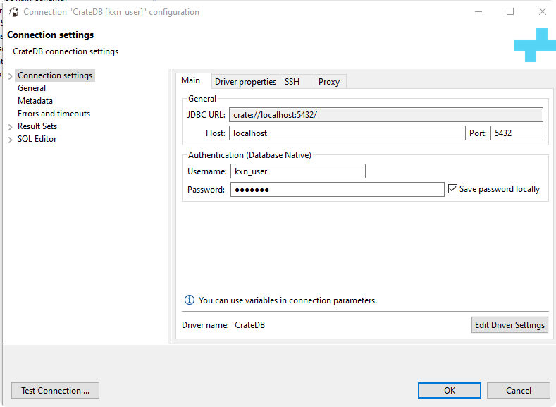
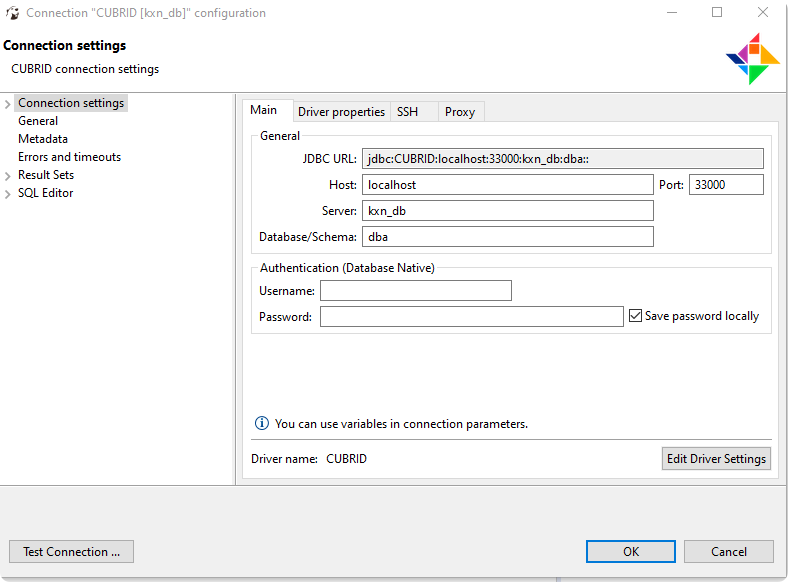
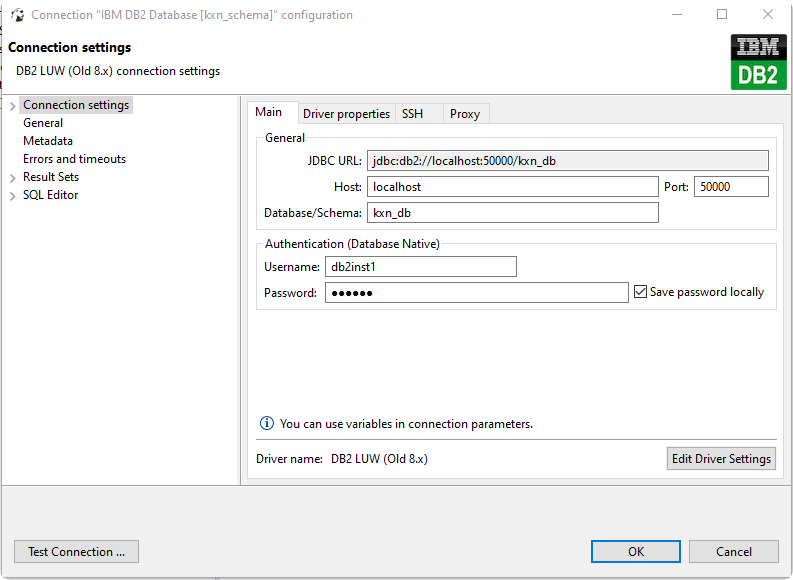
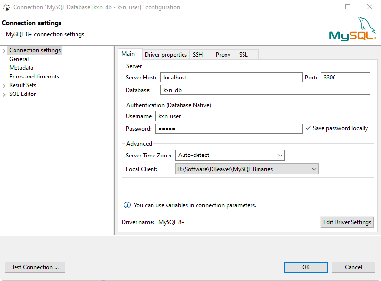
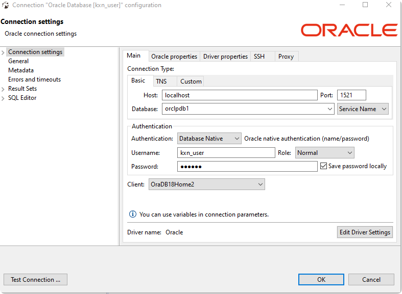

# db_seeder - Creation of Dummy Data in a Variety of Database Management Systems.


----

## 1. Introduction

`db_seeder` allows the generation of dummy data in different database management systems. 
Currently the following management database systems are supported:
- [Apache Derby](https://db.apache.org/derby/)
  - client and embedded version
  - open source
  - relational database management system (RDBMS) 
  - automatic data replication
  - embedded database engine
  - emdedded network server
  - very small footprint (ca. 3.5 MB)
- [CrateDB](https://crate.io/)
  - open source
  - relational database management system (RDBMS) 
  - automatic data replication
  - fast text search and analytics
  - integrates a fully searchable document-oriented data store
  - self-healing clusters for high availability
- [CUBRID](https://www.cubrid.org) 
  - open source
  - relational database management system (RDBMS) 
  - 3-tier client-server architecture (database server, connection broker and application layer)
  - high Availability provides load-balanced, fault-tolerant and continuous service availability through its shared-nothing clustering, automated fail-over and manual fail-back mechanisms
  - object extensions developed by CUBRID Corp. for OLTP
- [IBM Db2 Database](https://www.ibm.com/products/db2-database) 
  - relational database management system (RDBMS) 
  - supporting object-relational features and non-relational structures like JSON and XML
- [MariaDB Server](https://mariadb.com/) 
  - open source, but owned by Oracle
  - relational database management system (RDBMS) 
  - fork of the MySQL RDBMS
- [Microsoft SQL Server](https://www.microsoft.com/en-us/sql-server/sql-server-2019) 
  - relational database management system (RDBMS) 
- [MySQL Database](https://www.mysql.com/) 
  - open source, but owned by Oracle
  - relational database management system (RDBMS) 
  - component of the LAMP web application software stack
- [Oracle Database](https://www.oracle.com/database/)
  - relational database management system (RDBMS) 
  - running online transaction processing (OLTP), data warehousing (DW) and mixed (OLTP & DW) database workloads
- [PostgreSQL Database](https://www.postgresql.org/)
  - open source
  - relational database management system (RDBMS) 
  - emphasizing extensibility and SQL compliance
- [SQLite](https://www.sqlite.org/)
  - embedded version
  - open source
  - relational database management system (RDBMS) 
  - not a client–server database engine, it is embedded into the end program
  - weakly typed SQL syntax that does not guarantee the domain integrity

The names of the database, the schema and the user can be freely chosen, unless the respective database management system contains restrictions. 
If the selected database, schema or user already exists, it is deleted with all including data. 
`db_seeder` then creates the selected database, schema or user and generates the desired dummy data.
A maximum of 2 147 483 647 rows can be generated per database table.

### 1.1 Relational Database Management Systems

| DBMS | DB Ticker Symbol(s) | Tested Versions |
|---|---|---|
| Apache Derby | DERBY, DERBY_EMB | 10.15.2.0 | 
| CrateDB | CRATEDB | 4.1.6 | 
| CUBRID | CUBRID | 10.2 | 
| IBM Db2 Database | IBMDB2 | 11.5.1.0 | 
| MariaDB Server | MARIADB | 10.4.13 - 10.5.3 | 
| Microsoft SQL Server | MSSQLSERVER | 2019| 
| MySQL Database | MYSQL | 8.0.20 | 
| Oracle Database | ORACLE | 12c, 18c, 19c |
| PostgreSQL Database | POSTGRESQL | 12.3 |
| SQLite | SQLITE | 3.32.2 |

## 2. Data Model

The underlying data model is quite simple and is shown here in the relational version.
The 5 database tables CITY, COMPANY, COUNTRY, COUNTRY_STATE, and TIMEZONE form a simple hierarchical structure and are therefore connected in the relational model via corresponding foreign keys.  

The abbreviations in the following illustration (created with Toad Data Modeler) mean:

- (AK1) - alternate key (unique key)
- FK    - foreign key
- NN    - not null
- PK    - primary key


## 3. Installation

The easiest way is to download a current release of `db_seeder`.
You can find the necessary link [here](https://github.com/KonnexionsGmbH/db_seeder).
The system requirements are described in the respective release notes. 

## 4. Operating Instructions 

Using the Konnexions development docker image from DockerHub (see [here](https://hub.docker.com/repository/docker/konnexionsgmbh/kxn_dev)) saves the effort of installing the latest Java version. 
To run `db_seeder`, only the libraries in the `lib` directory and the appropriate batch script of `run_db_seeder` are required. 
All parameters used in `db_seeder` can be adjusted in the batch script to suit your needs.

### 4.1 Control Parameters - Basics

The flow control parameters for `db_seeder` are stored in the properties file `src/main/resources/db_seeder.properties` and can all be overridden by the environment variables defined in the batch script.
The following control parameters are currently supported:

```
db_seeder.cratedb.connection.port=5432
db_seeder.cratedb.connection.prefix=crate://
db_seeder.cratedb.password=cratedb
db_seeder.cratedb.user=kxn_user

db_seeder.cubrid.connection.port=33000
db_seeder.cubrid.connection.prefix=jdbc:CUBRID:
db_seeder.cubrid.database=kxn_db
db_seeder.cubrid.password=cubrid
db_seeder.cubrid.user=kxn_user

db_seeder.derby.connection.port=1527
db_seeder.derby.connection.prefix=jdbc:derby:
db_seeder.derby.database=kxn_db

db_seeder.ibmdb2.connection.port=50000
db_seeder.ibmdb2.connection.prefix=jdbc:db2://
db_seeder.ibmdb2.database=kxn_db
db_seeder.ibmdb2.password=ibmdb2
db_seeder.ibmdb2.schema=kxn_schema

db_seeder.jdbc.connection.host=localhost

db_seeder.mariadb.connection.port=3306
db_seeder.mariadb.connection.prefix=jdbc:mariadb://
db_seeder.mariadb.database=kxn_db
db_seeder.mariadb.password.sys=mariadb
db_seeder.mariadb.password=mariadb
db_seeder.mariadb.user=kxn_user

db_seeder.max.row.city=1800
db_seeder.max.row.company=5400
db_seeder.max.row.country=200
db_seeder.max.row.country_state=600
db_seeder.max.row.timezone=11

db_seeder.mssqlserver.connection.port=1433
db_seeder.mssqlserver.connection.prefix=jdbc:sqlserver://
db_seeder.mssqlserver.database=kxn_db
db_seeder.mssqlserver.password.sys=mssqlserver_2019
db_seeder.mssqlserver.password=mssqlserver_2019
db_seeder.mssqlserver.schema=kxn_schema
db_seeder.mssqlserver.user=kxn_user

db_seeder.mysql.connection.port=3306
db_seeder.mysql.connection.prefix=jdbc:mysql://
db_seeder.mysql.connection.suffix=?serverTimezone=UTC
db_seeder.mysql.database=kxn_db
db_seeder.mysql.password.sys=mysql
db_seeder.mysql.password=mysql
db_seeder.mysql.user=kxn_user

db_seeder.oracle.connection.port=1521
db_seeder.oracle.connection.prefix=jdbc:oracle:thin:@//
db_seeder.oracle.connection.service=orclpdb1
db_seeder.oracle.password.sys=oracle
db_seeder.oracle.password=oracle
db_seeder.oracle.user=kxn_user

db_seeder.postgresql.connection.port=5432
db_seeder.postgresql.connection.prefix=jdbc:postgresql://
db_seeder.postgresql.database=kxn_db
db_seeder.postgresql.password.sys=postgresql
db_seeder.postgresql.password=postgresql
db_seeder.postgresql.user=kxn_user

db_seeder.sqlite.connection.prefix=jdbc:sqlite:
db_seeder.sqlite.database=kxn_db
```

### 4.2 Control Parameters - Detailled

| Property incl. Default Value [db.seeder.] | Environment Variable [DB_SEEDER_] | Used By | Description |
| --- | --- | --- | --- |
| <db_ticker>.connection.port=<port_number> | <DB_TICKER>_CONNECTION_PORT | DERBY, CRATEDB, CUBRID, IBMDB2, MARIADB, MSSQLSERVER, MYSQL, ORACLE, POSTGRESQL | port number of the database server |
| <db_ticker>.connection.prefix=<url_prefix> | <DB_TICKER>_CONNECTION_PREFIX | DERBY, CRATEDB, CUBRID, IBMDB2, MARIADB, MSSQLSERVER, MYSQL, ORACLE, POSTGRESQL, SQLITE | prefix of the database connection string |
| <db_ticker>.connection.suffix=<url_suffix> | <DB_TICKER>_CONNECTION_SUFFIX | MYSQL | suffix of the database connection string |
| <db_ticker>.database=kxn_db | <DB_TICKER>_DATABASE | DERBY, CUBRID, IBMDB2, MARIADB, MSSQLSERVER, MYSQL, POSTGRESQL, SQLITE | database name |
| <db_ticker>.password.sys=<db_ticker> | <DB_TICKER>_PASSWORD_SYS | MARIADB, MSSQLSERVER, MYSQL, ORACLE, POSTGRESQL | password of the privileged user |
| <db_ticker>.password=<db_ticker> | <DB_TICKER>_PASSWORD | CRATEDB, CUBRID, IBMDB2, MARIADB, MSSQLSERVER, MYSQL, ORACLE, POSTGRESQL | password of the normal user |
| <db_ticker>.schema=kxn_schema | <DB_TICKER>_SCHEMA | IBMDB2, MSSQLSERVER | schema name |
| <db_ticker>.user=kxn_user | <DB_TICKER>_USER | CRATEDB, CUBRID, MARIADB, MSSQLSERVER, MYSQL, ORACLE, POSTGRESQL | name of the normal user |
| jdbc.connection.host=localhost | JDBC_CONNECTION_HOST | CRATEDB, CUBRID, IBMDB2, MARIADB, MSSQLSERVER, MYSQL, ORACLE, POSTGRESQL | name or ip address of the database server |
| max.row.t...t=9...9 | MAX_ROW_T...T | Relational DB | number of rows to be generated (per database table t...t) |
|     |     |     |     |

## 4. Database Management System Specifica

[DBeaver](https://dbeaver.io/) is a great tool to analyze the database content. 
Below are also DBeaver based connection parameter examples for each database management system. 

### 4.1 Apache Derby

- database driver version 10.15.2.0
  - Maven repository: 
    - client version [here](https://mvnrepository.com/artifact/org.apache.derby/derbyclient/10.15.2.0)
    - embedded version [here](https://mvnrepository.com/artifact/org.apache.derby/derby)
- database Docker image version 10.15.2.0: [here](https://hub.docker.com/repository/docker/konnexionsgmbh/apache_derby)
- data definition hierarchy: only database and schema (schema not relevant for db_seeder)
- privileged database / user: n/a / n/a

- data types used:

| Data Type | CrateDB Type |
| --- | --- |
| big integer | BIGINT |
| binary large object | BLOB |
| character large object | CLOB |
| string | VARCHAR |
| timestamp | TIMESTAMP |

- DBeaver database connection settings - client version:


- DBeaver database connection settings - embedded version:


### 4.2 CrateDB

- database driver version 2.6.0
  - JFrog Bintray repository: [here](https://bintray.com/crate/crate/crate-jdbc/2.6.0)
- database Docker image version 4.1.6: [here](https://hub.docker.com/_/crate)
- data definition hierarchy: only user
- privileged database / user: n/a / crate
- restrictions:
  - no constraints (e.g. foreign keys or unique keys)
  - no transaction concept
  - no triggers 
  - only a very proprietary BLOB implementation

- data types used:

| Data Type | CrateDB Type |
| --- | --- |
| big integer | BIGINT |
| binary large object | n/a |
| character large object | TEXT |
| string | TEXT |
| timestamp | TIMESTAMP |

- DBeaver database connection settings:



### 4.3 CUBRID

- database driver version 10.2.0.8797
  - Maven repository: [here](https://mvnrepository.com/artifact/cubrid/cubrid-jdbc?repo=cubrid)
- database Docker image version 10.2: [here](https://hub.docker.com/r/cubrid/cubrid)
- data definition hierarchy: database and user
- privileged database / user: n/a / dba

- data types used:

| Data Type | CrateDB Type |
| --- | --- |
| big integer | BIGINT |
| binary large object | BLOB |
| character large object | CLOB |
| string | VARCHAR |
| timestamp | TIMESTAMP |

- DBeaver database connection settings:



### 4.4 IBM Db2 Database

- database driver version 11.5.0.0 
  - Maven repository: [here](https://mvnrepository.com/artifact/com.ibm.db2/jcc/11.5.0.0)
- database Docker image version 11.5.0.0a: [here](https://hub.docker.com/r/ibmcom/db2)
- data definition hierarchy: only schema
- privileged database / user: n/a / db2inst1
- restrictions:
  - the IBM Db2 DBMS only accepts operating system accounts as database users 

- data types used:

| Data Type | IBM Db2 Database Type |
| --- | --- |
| big integer | BIGINT |
| binary large object | BLOB |
| character large object | CLOB |
| string | VARCHAR |
| timestamp | TIMESTAMP |

- DBeaver database connection settings:



### 4.5 MariaDB Server

- database driver version 2.6.0 
  - Maven repository: [here](https://mvnrepository.com/artifact/org.mariadb.jdbc/mariadb-java-client)
- database Docker image version 10.5.3: [here](https://hub.docker.com/_/mariadb)
- data definition hierarchy: database and user
- privileged database / user: mysql / root

- data types used:

| Data Type | MariaDB Server Type |
| --- | --- |
| big integer | BIGINT |
| binary large object | LONGBLOB |
| character large object | LONGTEXT |
| string | VARCHAR |
| timestamp | DATETIME |

- DBeaver database connection settings:


### 4.6 Microsoft SQL Server

- database driver version 8.31 
  - Maven Repository: [here](https://mvnrepository.com/artifact/com.microsoft.sqlserver/mssql-jdbc)
- database Docker image version 2019: [here](https://hub.docker.com/_/microsoft-mssql-server)
- data definition hierarchy: database, schema and user
- privileged database / user: master / sa

- data types used:

| Data Type | Microsoft SQL Server Type |
| --- | --- |
| big integer | BIGINT |
| binary large object | VARBINARY (MAX) |
| character large object | VARCHAR (MAX) |
| string | VARCHAR |
| timestamp | DATETIME2 |

- DBeaver database connection settings:


### 4.7 MySQL Database

- database driver version 8.0.20 
  - Maven repository: [here](https://mvnrepository.com/artifact/mysql/mysql-connector-java)
- database Docker image version 8.0.20: [here](https://hub.docker.com/_/mysql)
- data definition hierarchy: database and user
- privileged database / user: sys / root

- data types used:

| Data Type | MySQL Database Type |
| --- | --- |
| big integer | BIGINT |
| binary large object | LONGBLOB |
| character large object | LONGTEXT |
| string | VARCHAR |
| timestamp | DATETIME |

- DBeaver database connection settings:



### 4.8 Oracle Database

- database driver version 
  - Maven repository 19.3.0.0: [here](https://mvnrepository.com/artifact/com.oracle.ojdbc/ojdbc8)
  - Software 19.6.0.0.0: [here](https://www.oracle.com/database/technologies/instant-client/downloads.html)
- database Docker image version 19c
- data definition hierarchy: user
- privileged database / user: orclpdb1 / sys AS SYSDBA

- data types used:

| Data Type | Oracle Database Type |
| --- | --- |
| big integer | NUMBER |
| binary large object | BLOB |
| character large object | CLOB |
| string | VARCHAR2 |
| timestamp | TIMESTAMP |

- DBeaver database connection settings:



### 4.9 PostgreSQL Database

- database driver version 42.2.13
  - Maven repository: [here](https://mvnrepository.com/artifact/org.postgresql/postgresql)
- database Docker image version 12.3: [here](https://hub.docker.com/_/postgres)
- data definition hierarchy: database, schema and user
- privileged database / user: kxn_db_sys / kxn_user_sys

- data types used:

| Data Type | PostgreSQL Database Type |
| --- | --- |
| big integer | BIGINT |
| binary large object | BYTEA |
| character large object | TEXT |
| string | VARCHAR |
| timestamp | TIMESTAMP |

- DBeaver database connection settings:


### 4.10 SQLite

- database driver version 3.31.1
  - Maven repository: [here](https://mvnrepository.com/artifact/org.xerial/sqlite-jdbc)
- no database Docker image necessary, hence not available
- data definition hierarchy: database
- privileged database / user: n/a / n/a
- restrictions:
  - no Docker image necessary, hence not available
  - no user management 

- data types used:

| Data Type | SQLite Type |
| --- | --- |
| big integer | INTEGER |
| binary large object | BLOB |
| character large object | TEXT |
| string | TEXT |
| timestamp | INTEGER / REAL / TEXT |

- DBeaver database connection settings:


## 5. Contributing 

In case of software changes we strongly recommend you to respect the license terms.

1. Fork it
1. Create your feature branch (git checkout -b my-new-feature)
1. Commit your changes (git commit -am 'Add some feature')
1. Push to the branch (git push origin my-new-feature)
1. Create a new Pull Request
1. Action points to be considered when adding a new database:
    1. lib/<database_driver>.jar
    1. scripts/run_db_seeder_setup_<database>.bat
    1. src/main/java/ch/konnexions/db_seeder/AbstractDatabaseSeeder.java
    1. src/main/java/ch/konnexions/db_seeder/Config.java
    1. src/main/java/ch/konnexions/db_seeder/DatabaseSeeder.java
    1. src/main/java/ch/konnexions/db_seeder/jdbc/<database>/<Database>Seeder.java
    1. src/main/resources/db_seeder.properties
    1. .travis.yml
    1. build.gradle
    1. README.md
    1. Release-Notes.md
    1. run_db_seeder.bat
    1. run_db_seeder.sh
    1. run_db_seeder_setup_dbms.bat
    1. run_db_seeder_setup_dbms.sh
